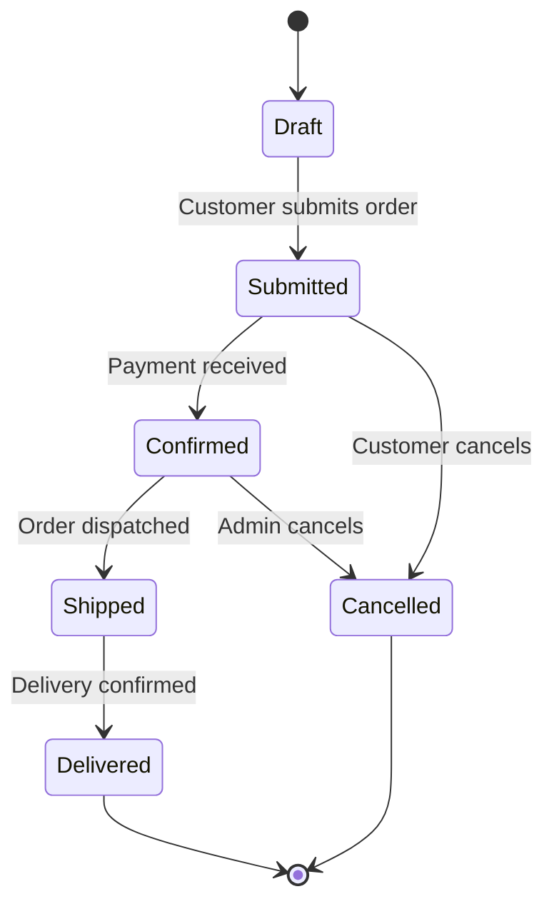
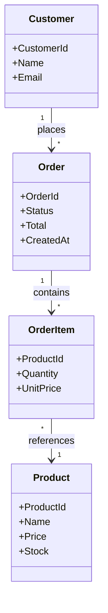
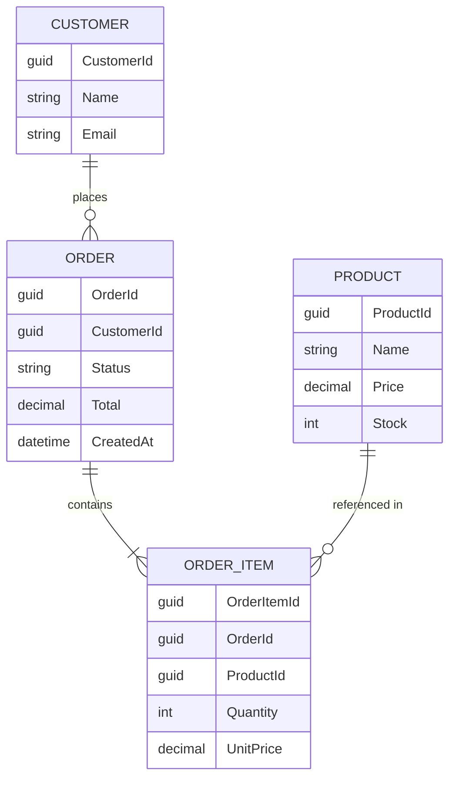
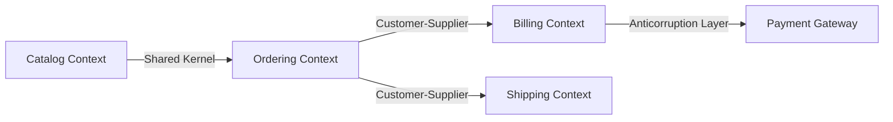
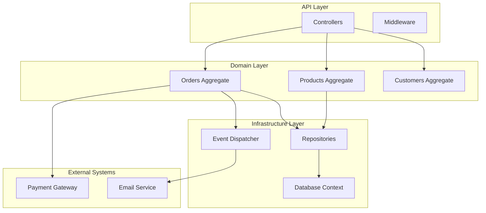

# DDD Documents — TemperAI Standards

This skill teaches how to generate the three DDD documentation artifacts.
It covers why each document exists, how to extract information from the PRD,
and the exact structure and templates for each.

## Documents and Their Purpose

| Document | Location | Purpose | Generated From |
|---|---|---|---|
| `DDD-Vocabulary.md` | `.temper/DDD-Vocabulary.md` | Single source of truth for domain terminology. Consumed by implementation agents at build time. | PRD nouns, status words, actions |
| `domain-model.md` | `Docs/domain-model.md` | Entity model, aggregates, state transitions, domain events, business rules, and diagrams. Replaces DDD-Entities + DDD-Events + DDD-Rules. | PRD entities, workflows, rules |
| `system-architecture.md` | `Docs/system-architecture.md` | Bounded contexts, context map, component diagram, external integrations. Replaces DDD-Overview. | PRD user roles, domain areas, external systems |

---

## Generation Order

Always generate DDD documents in this order:

```
1. DDD-Vocabulary.md       → Foundation. All other docs reference these terms.
2. domain-model.md          → Entity structure. Depends on vocabulary for consistent naming.
3. system-architecture.md   → System view. Depends on vocabulary + entity model for context boundaries.
```

**Reason:** Each document builds on the previous. Vocabulary defines the language,
domain-model defines the structural and behavioral model using that language,
system-architecture defines the system-level decomposition based on the model.

---

## Document Definitions

### DDD-Vocabulary.md

**What it is:** The Ubiquitous Language — a glossary where every term has exactly one definition.
No synonyms. No ambiguity. Implementation agents read this to understand domain terminology.

**Why it exists:** Without a shared vocabulary, the same concept gets called different names
in specs, tasks, and code. This causes confusion and bugs. The vocabulary ensures everyone
uses the same words for the same things.

**Output location:** `.temper/DDD-Vocabulary.md`

**What goes in it:**

1. **Term table** — every domain term with its type and one-sentence definition
2. **Rejected terms** — terms that were considered but rejected, with reason and preferred term
3. **Translation table** — how domain terms map to API field names (if they differ)

**Term types:**
- `Entity` — something with identity that persists
- `Aggregate` — a cluster of entities treated as a unit for data changes
- `Value Object` — something defined by its attributes, no identity
- `Service` — an operation that doesn't belong to any entity
- `Event` — something that happened in the domain (past tense)
- `Enum` — a fixed set of values

**Rules:**
- Each term appears exactly once
- Definitions are one sentence max
- No technical terms in definitions (no "GUID", no "database", no "DTO")
- If a term has multiple meanings, split it into multiple terms

**Template:**

```markdown
# DDD Vocabulary — [Project Name]

> Generated by TemperAI — temper-architect
> Date: [YYYY-MM-DD]
> Version: [YYYYMMDD-HHMM]
> Status: Confirmed

---

## Ubiquitous Language

| Term | Type | Definition |
|---|---|---|
| [Term] | [Entity / Aggregate / Value Object / Service / Event / Enum] | [One-sentence definition] |

## Rejected Terms

| Rejected | Reason | Preferred Term |
|---|---|---|
| [Term] | [Why rejected] | [Preferred term] |

## Translation Table (Domain → API)

| Domain Term | API Name | Notes |
|---|---|---|
| [Domain term] | [API field name] | [Any translation notes] |
```

---

### domain-model.md

**What it is:** The tactical DDD model — entities, aggregates, state transitions, domain events,
business rules, and entity relationships with Mermaid diagrams. One coherent document that
replaces the previous DDD-Entities, DDD-Events, and DDD-Rules documents.

**Why it exists:** Splitting entities, events, and rules into separate documents created friction.
Developers had to cross-reference three files to understand a single aggregate. This document
brings everything together so the full picture of each entity — its structure, behavior, and
constraints — is visible in one place.

**Output location:** `Docs/domain-model.md`

**Sections:**

1. **Entity Index** — table of all entities with type and summary
2. **Aggregates** — per-aggregate sections with root, children, invariants, properties
3. **State Transitions** — per-entity state diagrams using Mermaid `stateDiagram-v2`
4. **Domain Events** — per-entity events with name, trigger, and data fields
5. **Business Rules** — organized by entity with rule description, owner, enforcement, and error
6. **Entity Relationships** — Mermaid `classDiagram` showing how entities connect
7. **ER Diagram** — Mermaid `erDiagram` showing the data model
8. **Identity Strategy** — how each entity is identified

**Rules:**
- No implementation details — no DTOs, no repository interfaces, no C# types, no EF Core references
- Diagrams MUST use Mermaid syntax
- Events are named in past tense (OrderPlaced, PaymentReceived)
- Rules have clear owners — the aggregate or entity that enforces them
- Each aggregate section must list its invariants explicitly
- State transitions must show valid transitions and blocking conditions

**Template:**

```markdown
# Domain Model — [Project Name]

> Generated by TemperAI — temper-architect
> Date: [YYYY-MM-DD]
> Version: [YYYYMMDD-HHMM]
> Status: Confirmed

---

## Entity Index

| Entity | Type | Summary |
|---|---|---|
| [Entity] | [Aggregate Root / Entity / Value Object] | [One-line description] |

---

## Aggregates

### [Aggregate Root Name]

**Type:** Aggregate Root
**Responsibility:** [What this aggregate is responsible for]
**Invariants:**
- [Invariant 1 — must always be true]
- [Invariant 2]

**Properties:**

| Property | Type | Required | Description |
|---|---|---|---|
| [Property] | [Domain type] | [Yes/No] | [Description] |

**Child Entities:**

#### [Child Entity Name]

**Access:** Only through [Aggregate Root Name]

| Property | Type | Required | Description |
|---|---|---|---|
| [Property] | [Domain type] | [Yes/No] | [Description] |

---

## State Transitions

### [Entity Name]



**Transition Conditions:**

| From | To | Condition |
|---|---|---|
| Draft | Submitted | All required items present |
| Submitted | Confirmed | Valid payment received |
| Submitted | Cancelled | Customer requests cancellation before confirmation |
| Confirmed | Shipped | Order packed and dispatched |
| Confirmed | Cancelled | Admin overrides and cancels |
| Shipped | Delivered | Delivery confirmation received |

---

## Domain Events

### [Entity Name] Events

| Event | Trigger | Data Fields |
|---|---|---|
| [EventName] | [When raised] | [field1], [field2], [field3] |

#### [EventName]

**Raised by:** [Entity or Aggregate]
**Trigger:** [When this event is raised]
**Data:**
- [field]: [domain type] — [description]

**Consumers:**
- [Which bounded contexts or external systems react]

---

## Business Rules

### [Entity Name] Rules

| Rule | Owner Entity | Enforcement | Error When Violated |
|---|---|---|---|
| [Rule description] | [Entity] | [How enforced] | [What happens / error message] |

### Invariant Rules (Enforced by Aggregates)

| Rule | Aggregate | Enforcement | Error When Violated |
|---|---|---|---|
| [Rule description] | [Aggregate] | [How enforced] | [What happens / error message] |

### Transition Rules

| Entity | From State | To State | Conditions |
|---|---|---|---|
| [Entity] | [State A] | [State B] | [Conditions required for transition] |

### Calculation Rules

| Rule | Input | Calculation | Output |
|---|---|---|---|
| [Rule] | [Inputs] | [How calculated] | [Result] |

---

## Entity Relationships



---

## ER Diagram



---

## Identity Strategy

| Entity | Identity Type | Generation |
|---|---|---|
| [Entity] | [GUID / Int / String / Composite] | [Auto / User-provided / Derived] |
```

---

### system-architecture.md

**What it is:** The strategic DDD view — bounded contexts, context map with Mermaid diagrams,
component architecture, and external integrations. Shows how the system is divided and how
it communicates internally and with the outside world.

**Why it exists:** In complex systems, not everything is related to everything else.
Bounded contexts define where certain terms and rules apply. Understanding boundaries
prevents accidental coupling and helps teams work independently. This document replaces
the previous DDD-Overview with richer diagram support.

**Output location:** `Docs/system-architecture.md`

**Sections:**

1. **Bounded Contexts** — each context with responsibility, core domain, and language terms
2. **Context Map** — Mermaid `graph` showing context relationships with labeled edges
3. **Component Diagram** — Mermaid `graph` with subgraphs for architectural layers
4. **External Integrations** — table of third-party systems with type, description, and integration points
5. **Anticorruption Layer** — protection mechanisms (if applicable)

**Context relationship types (for the map):**
- `Shared Kernel` — both contexts share a subset of the model
- `Customer-Supplier` — one context provides services to the other
- `Conformist` — one context adapts to the other's model
- `Anticorruption Layer` — one context translates to protect its own model
- `Open Host Service` — one context exposes a protocol others consume

**Rules:**
- Integrations described from the domain perspective, not the technical perspective
- Context map must show relationships between contexts with labeled edges
- Component diagram must show the architectural layers (API, Domain, Infrastructure, External)
- Each bounded context should have a clear, single responsibility
- If a term appears in multiple contexts, note whether it has the same meaning in each

**Template:**

```markdown
# System Architecture — [Project Name]

> Generated by TemperAI — temper-architect
> Date: [YYYY-MM-DD]
> Version: [YYYYMMDD-HHMM]
> Status: Confirmed

---

## Bounded Contexts

### [Context Name]

**Description:** [What this context is responsible for]
**Core Domain:** [The primary subdomain it serves]
**Ubiquitous Language terms:** [Comma-separated list of terms from vocabulary that belong to this context]

---

## Context Map



**Relationships:**

| From | To | Type | Description |
|---|---|---|---|
| Ordering | Billing | Customer-Supplier | Ordering provides order data to Billing for invoice generation |
| Ordering | Shipping | Customer-Supplier | Ordering provides fulfilled orders to Shipping for dispatch |
| Catalog | Ordering | Shared Kernel | Both contexts share product identity and pricing |
| Billing | Payment Gateway | Anticorruption Layer | Billing translates external payment model into domain terms |

---

## Component Diagram



---

## External Integrations

| System | Type | Description | Integration Points |
|---|---|---|---|
| [External service] | [Payment / Email / SMS / etc.] | [What it does for the domain] | [How this system interacts with it] |

---

## Anticorruption Layer

### [Protection Name]

**Protects:** [Which bounded context is being protected]
**From:** [Which external system or context]
**Mechanism:** [How the translation works — domain terms, not technical]

**Translation rules:**
- [External concept] → [Internal domain concept]
- [External concept] → [Internal domain concept]
```

---

## Extraction Patterns

All extraction is done from the PRD. The architect does NOT read specs.

### From PRD to DDD-Vocabulary

Read the PRD and extract:
- **Nouns that represent things the system manages** → Entity, Aggregate, or Value Object terms
- **Status or category words** → Enum terms (e.g. "pending", "shipped", "delivered" → OrderStatus enum)
- **Actions the system performs** → Service terms (e.g. "process payment" → PaymentProcessing service)
- **"When X happens, Y occurs"** → Event terms (e.g. "When order is placed" → OrderPlaced event)

### From PRD to domain-model

Read the PRD and extract:
- **Nouns the system manages** → Entity candidates
- **"Has a" / "contains" / "belongs to"** → Relationships between entities
- **"Part of" / "line item" / "detail"** → Child entities within an aggregate
- **Status workflows and transitions** → State transitions with Mermaid `stateDiagram-v2`
- **State changes that other parts of the system need to know about** → Domain events
- **Business rules section** → Invariants, validation rules, transition rules
- **Calculations and formulas** → Calculation rules
- **"Must always be true" statements** → Aggregate invariants
- **Edge cases and error cases** → Validation rules

### From PRD to system-architecture

Read the PRD and extract:
- **User roles** → Bounded context signals (different roles often indicate different contexts)
- **Domain areas that change independently** → Bounded context boundaries
- **External systems mentioned** → Integration points
- **Third-party services** → External integrations table
- **Integration boundaries** → Anticorruption layer candidates

---

## Common Mistakes

### Vocabulary mistakes

- **Defining a term by what it does instead of what it is** — "Order is a container for items" not "Order manages products"
- **Using technical terms in definitions** — "Order ID is a GUID" instead of "Order ID uniquely identifies an order"
- **Having multiple definitions for the same term** — if a term has two meanings, create two separate terms

### Domain model mistakes

- **Mixing aggregate roots and child entities** — child entities should not have their own identity outside the aggregate
- **Including technical types or implementation details** — no DTOs, no repository interfaces, no EF Core references
- **Commands disguised as events** — "SendOrderConfirmation" is a command, "OrderConfirmationSent" is an event
- **Events with instructions** — events say what happened, not what should happen next
- **Vague rules** — "Order must be valid" is not a rule, "Order total must equal sum of item prices" is
- **Rules without owners** — every rule should have a clear aggregate or entity responsible
- **Missing Mermaid diagrams** — every entity with state must have a `stateDiagram-v2`, relationships must have a `classDiagram`
- **Diagram syntax errors** — always validate Mermaid syntax: correct arrow types, proper labels, quoted strings when needed
- **Abstract diagram examples** — use real domain entities (Order, Product, Customer) never placeholders (A, B, C)
- **Splitting entity knowledge across documents** — keep all information about an aggregate (structure, events, rules, transitions) together

### System architecture mistakes

- **Describing integrations in technical terms** — "REST API to payment provider" instead of "Processes payments on behalf of orders"
- **Creating too many bounded contexts** — if everything is its own context, the boundaries are meaningless
- **Forgetting the context map** — showing contexts without relationships doesn't show how they interact
- **Flat component diagrams** — must use subgraphs to show architectural layers (API, Domain, Infrastructure, External)
- **Unlabeled context map edges** — every relationship on the context map must have a type label

---

## Absolute Rules

- **ALWAYS generate in order** — Vocabulary first, then domain-model, then system-architecture
- **ALWAYS load this skill** when generating DDD documents
- **NEVER generate DDD docs without reading the PRD first** — the PRD is the only extraction source
- **NEVER mix implementation details** (DTOs, repositories, EF Core, C# types) into DDD documentation
- **NEVER use technical types** (GUID, int, string) in Vocabulary definitions
- **ALWAYS use Mermaid syntax** for diagrams — `stateDiagram-v2`, `classDiagram`, `erDiagram`, `graph`
- **ALWAYS place DDD-Vocabulary.md in `.temper/`** and other docs in `Docs/`**
- **ALWAYS keep definitions to one sentence** — if it needs more explanation, the term is too complex
- **ALWAYS reference existing vocabulary terms** — when defining a new term, check if a term already exists for that concept
- **ALWAYS use realistic entity names in diagrams** — never use abstract placeholders
